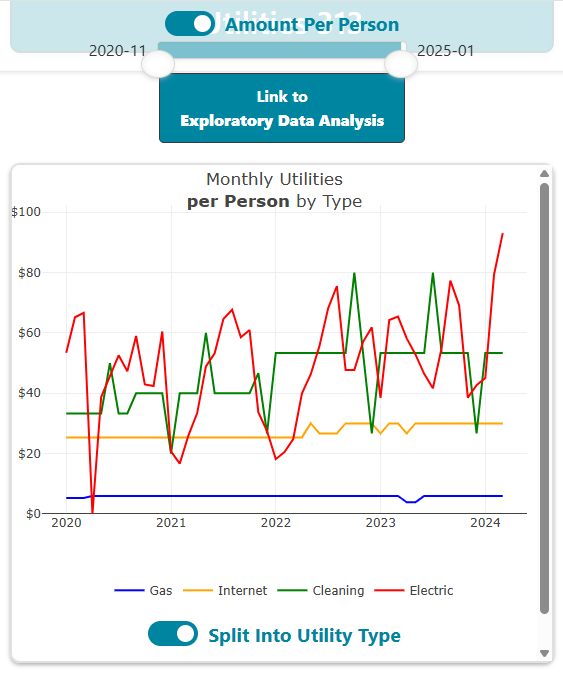
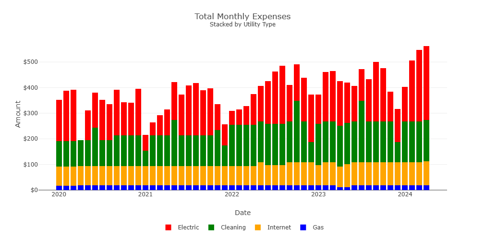
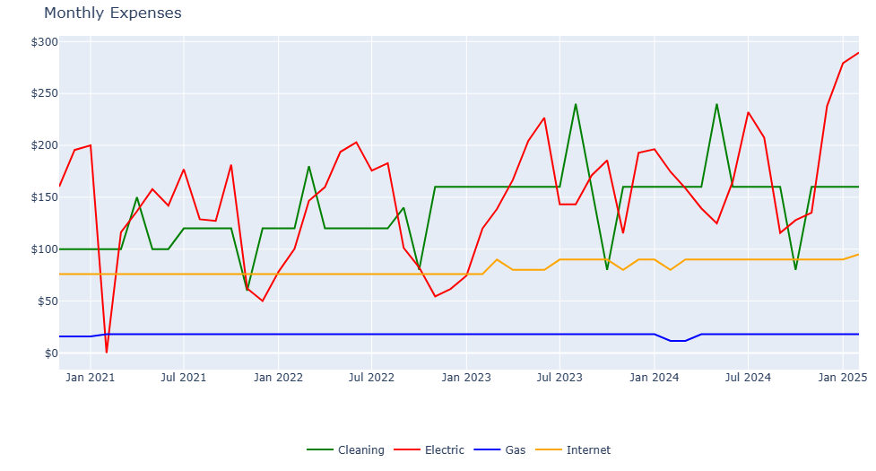
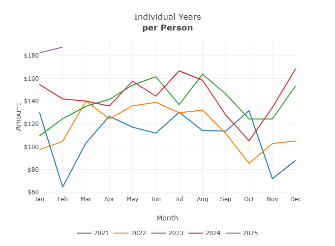
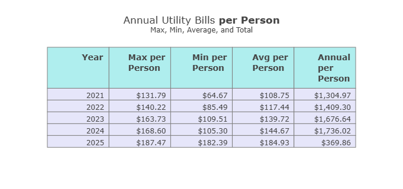
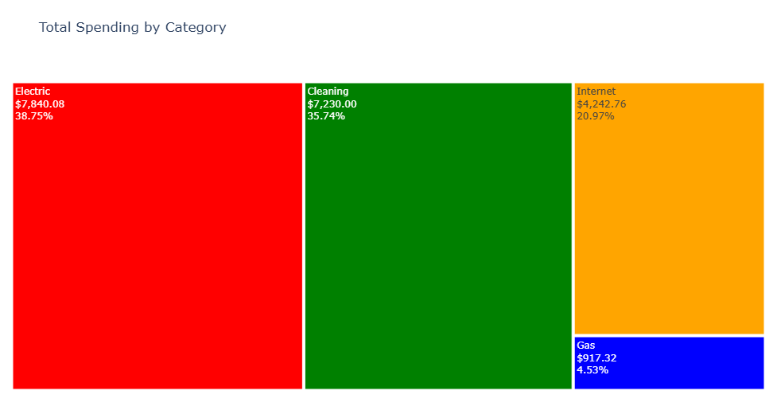

# Utilities-313 Dashboard


*Utility data meets personal history—visualized with Python, JavaScript, and Plotly.*

🔗 [Live Dashboard](https://johbry17.github.io/utilities-313/)  
🔗 [EDA Report](https://johbry17.github.io/utilities-313/utilities_313_EDA.html)

> ℹ️ Status: While not under active development, data and dashboards are refreshed regularly as new information becomes available.


## Table of Contents

- [Project Overview](#project-overview)
- [Features](#features)
- [Tools & Technologies](#tools--technologies)
- [Usage](#usage)
- [Gallery](#gallery)
- [References](#references)
- [Acknowledgements](#acknowledgements)
- [Author](#author)

## Project Overview

**Utilities-313** is a personal data visualization project that combines frontend interactivity with backend automation to explore utility expenses in a household context. What began as a hobby dashboard evolved into a hybrid full-stack tool: part financial tracker, part energy awareness tool, part time capsule.

This project includes:
- An interactive web dashboard with responsive visuals
- An automated, Python-based EDA pipeline
- A data update workflow powered by Google Sheets and Jupyter

The goal: turn ordinary household data into visual storytelling that’s accessible, insightful, and a bit nostalgic.


## Features

- Stacked bar charts of monthly bills by category  
- Line charts showing long-term trends  
- Treemaps visualizing category proportions  
- Hover interactions for detailed tooltips  
- EDA report with summary stats and time series analysis  
- Mobile-friendly layout

## Tools & Technologies

- **Frontend:** JavaScript, D3.js, Plotly.js, Bootstrap  
- **Backend:** Python, Pandas, Jupyter Notebook  
- **Data pipeline:** Google Sheets API, CSV  
- **Visual Design:** HTML/CSS, responsive layout  
- **Automation:** `nbconvert` for dynamic EDA report generation

## Usage

Visit the live dashboard here:  
🔗 [https://johbry17.github.io/utilities-313/](https://johbry17.github.io/utilities-313/)

Explore the full EDA report here:  
🔗 [https://johbry17.github.io/utilities-313/utilities_313_EDA.html](https://johbry17.github.io/utilities-313/utilities_313_EDA.html)


#### Updating the Dataset

1. Open the Jupyter Notebook: `./resources/extract_data.ipynb`  
2. Click **Run All** to fetch and process the latest data from Google Sheets  
3. Regenerate the EDA HTML from the terminal:  
```jupyter nbconvert --to html --execute --no-input utilities_313_EDA.ipynb```
4. Update HTML metadata (favicon, title, etc.):  
```python inject_metadata_to_EDA.py```


## Gallery

Dashboard Overview:



Monthly Utilities by Category:



Electricity Trend:



Bills by Year:



Tabular Summary:



Utility Spending Breakdown:



## References

Data sourced from a personal record of household utility expenses.

## Acknowledgements

Special thanks to the utility providers who kept the lights on, the water running, and the house clean—and to all the roommates over the years who shared the bills and the memories.

## Author

Bryan Johns, March 2025  
[bryan.johns@informedwanderer.com](mailto:bryan.johns@informedwanderer.com) | [LinkedIn](https://www.linkedin.com/in/b-johns/) | [GitHub](https://github.com/johbry17) | [Portfolio](https://informedwanderer.com)

